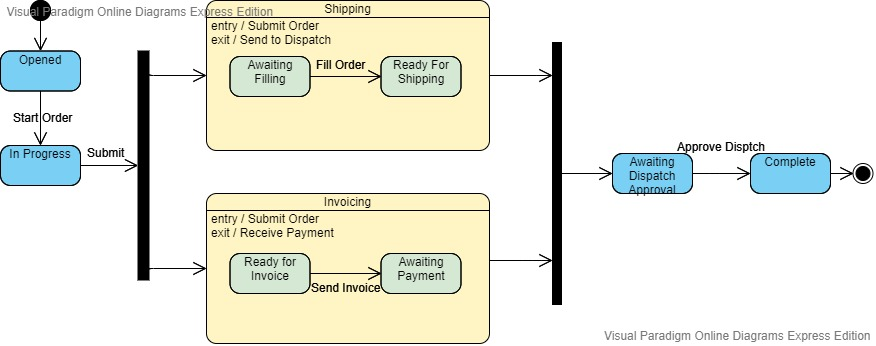

# Spring Statemachine With Sub-states and Persistence 
This is a small demo project done to prove that we could create a configurable state machine that could have states and sub-states and could still persist and restore the state machine into a sql database.

Most of the information I found on line regarding persisting state machine used in NoSql databases. I have to credit [Oliver Trosien](https://github.com/otrosien).  Using his [spring-statemachine-jpa-and-rest](https://github.com/otrosien/spring-statemachine-jpa-and-rest) as a guide I was able to get persistence working for my use case.

## The State Machine
I have based this on an order processing scenario.  It isn't meant to be a realistic case but just to demonstrate technical possibilities.

When the state machine is started an order is created in the opened status.  When it is submitted two processes are done in parallel, order fulfillment and payment processing.  Only when both these processes have completed will the order state move to "Awaiting Dispatch approval".
 
The below shows the complete flow.

## Persistence
A simple JPA Entity (OrderEntity) is used to hold the StateMachineContext in a binary-serialized form, using [Kryo](https://github.com/EsotericSoftware/kryo).  The state is also stored as String and sub-states are stored as Strings in a linked table.

A H2 in memory database is used to hold the data.

## The API
### /api/v1/events

#### GET
##### Responses

| Code | Description |
| ---- | ----------- |
| 200 | default response |

##### Lists Events

| EVENT ID |
| ----------- |
|TART_ORDER|
|SUBMIT_ORDER|
|FILL_ORDER|
|SEND_TO_DISPATCH|
|MOVE_TO_AWAITING_DISPATCH_APPROVAL|
|APPROVE_DISPATCH|
|SEND_INVOICE|
|RECEIVE_PAYMENT|

### /api/v1/events/newOrder

#### POST
##### Responses

| Code | Description |
| ---- | ----------- |
| 200 | default response |

### /api/v1/events/{id}/{event}

#### POST
##### Parameters

| Name | Located in | Description | Required | Schema |
| ---- | ---------- | ----------- | -------- | ---- |
| id | path |  | Yes | long |
| event | path |  | Yes | string |

##### Responses

| Code | Description |
| ---- | ----------- |
| 200 | default response |

### Models

#### OrderEntity

| Name | Type | Description | Required |
| ---- | ---- | ----------- | -------- |
| id | long |  | No |
| state | string |  | No |
| subStates | [ string ] |  | No |
| amount | number |  | No |

